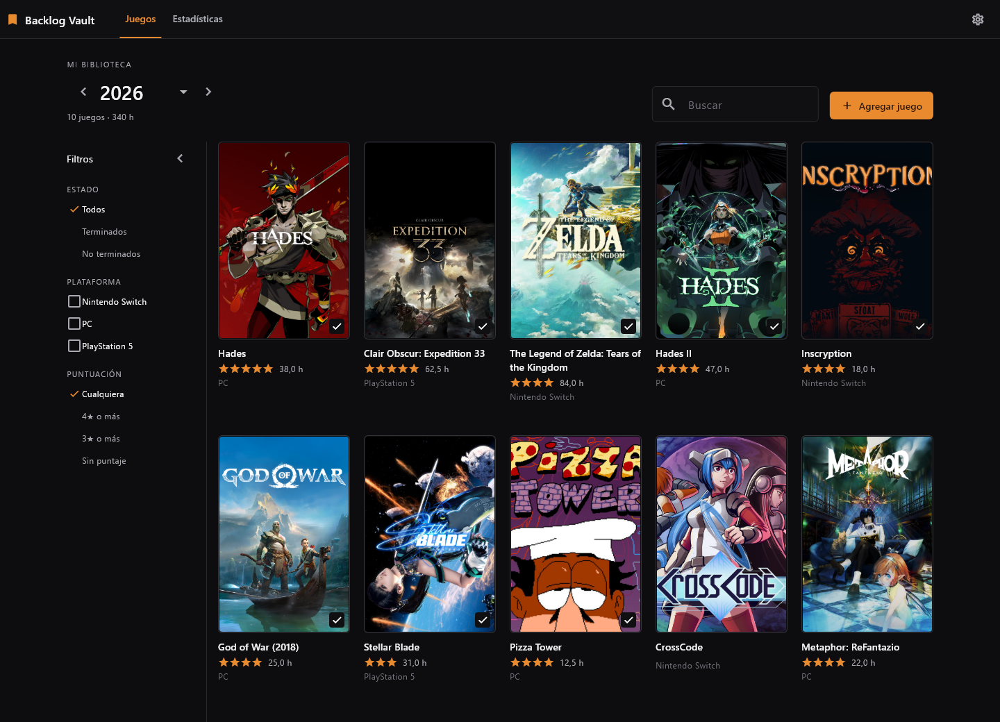
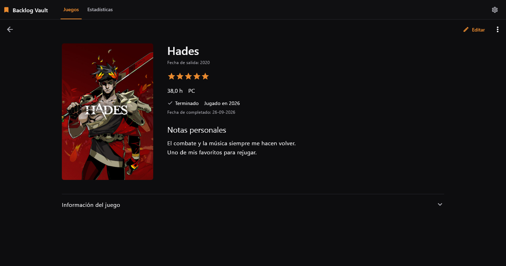
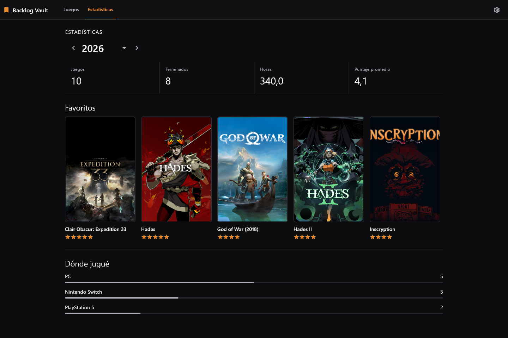

<p align="center">
  
</p>

<p align="center">Un registro personal y offline de los videojuegos que jugás.</p>

<p align="center"><a href="README.md">English</a></p>

Backlog Vault guarda un registro personal de los juegos que jugaste. Recorré tu biblioteca por año y anotá si terminaste cada juego, las horas jugadas, el puntaje, la plataforma y tus notas. La biblioteca y las portadas quedan en tu dispositivo; las fuentes de metadatos online son opcionales.

## Funciones

- Galería anual de portadas, con acceso a juegos sin año jugado conocido.
- Un registro personal por juego: terminado o no terminado, año jugado, fecha opcional de finalización, horas jugadas, puntaje personal, plataforma jugada y notas.
- Búsqueda y filtros simples por finalización, plataforma jugada y puntaje. Los juegos terminados con fecha aparecen del más reciente al más antiguo.
- Estadísticas anuales, favoritos y un resumen de dónde jugaste.
- Carga manual de juegos, metadatos opcionales desde RAWG e IGDB, y portadas desde IGDB, SteamGridDB o archivos locales.
- Importación de CSV de Notion y exportación de la biblioteca a JSON legible.
- Español e inglés, con temas de sistema, claro y oscuro.

## Capturas

Interfaz de escritorio con datos de muestra.



<details>
<summary>Registro personal y estadísticas anuales</summary>





</details>

## Descargas

Consultá [Releases](https://github.com/FedericoGR/Backlog-Vault/releases) para ver las versiones publicadas y sus notas.

- **ZIP portable para Windows:** extraé el archivo completo y ejecutá `backlog_vault.exe`.
- **APK para Android:** instalá el APK en un dispositivo compatible. El RC actual usa firma debug para pruebas personales.

Consultá [instalación y portabilidad](docs/install_and_portability.md) para más información sobre actualizaciones, datos locales y respaldos.

## Compilación

Usá Flutter 3.44.1 stable con las herramientas de Windows o Android configuradas. Ejecutá `flutter doctor` para revisar tu entorno.

```sh
flutter pub get
flutter run
```

Para compilar una versión release:

```sh
flutter build windows --release
flutter build apk --release
```

Los scripts de build y empaquetado están en `tool/`. Consultá la [guía de build de release](docs/build/release_build_and_packaging.md).

## Estado del proyecto

Versión candidata actual: **v1.0.0-rc2** (`1.0.0-rc2+7`). Windows es la plataforma principal de pruebas. La versión para Android está disponible y sigue recibiendo mejoras de usabilidad.

## Contribuir

Los reportes de errores y las pull requests con cambios puntuales son bienvenidos. Incluí tu plataforma y los pasos para reproducir el problema. Para cambios de código, ejecutá `flutter analyze` y `flutter test` antes de enviarlos.

## Licencia

El proyecto todavía no tiene una licencia definida.
