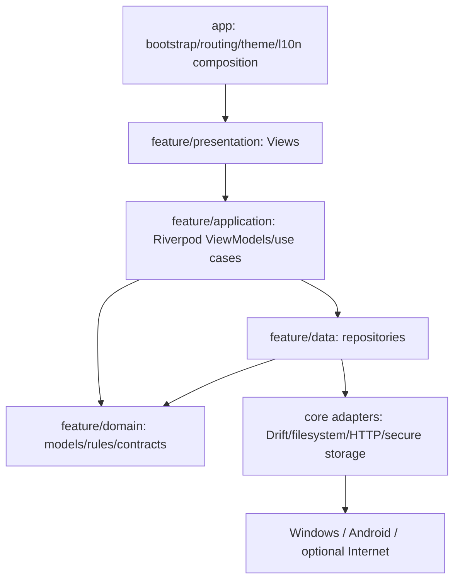

# ADR-001 — Arquitectura Offline

- Estado: implementado por E4; aprobado por Federico antes de E2.
- Fecha: 2026-07-16.
- Aprobación registrada: 2026-07-17.
- Decisores: Federico + implementación revisada por entregable.

## Contexto

Backlog Vault pasa de una aplicación local-first con Sync a una aplicación completamente local, sin cuentas, pairing, QR ni LAN. Debe mantener Windows/Android, Drift, Riverpod, metadata/media opcionales e import/export. La arquitectura actual ya es parcialmente feature-first, pero páginas y repositories son grandes, Drift se filtra a capas superiores y Sync cruza siete repositorios.

## Decisión

Adoptar **feature-first + MVVM pragmático + Repository/Service**, con domain/use cases selectivos.

### Reglas obligatorias

1. `core` no importa features; `domain` no importa Flutter/Drift/plugins.
2. Presentation no importa Drift ni usa `File`, HTTP, secure storage o plugins directamente.
3. ViewModels/Notifiers gestionan state y commands de un screen/workflow; widgets sólo layout/animación/routing simple.
4. Repository es source of truth de un aggregate/capacidad y no depende de otro repository.
5. Service/DataSource envuelve una fuente externa concreta y no contiene state de UI.
6. Use case sólo para regla reutilizada, coordinación multi-repo, operación compleja o transacción de dominio.
7. Interfaces sólo cuando hay sustitución real, boundary valioso o fake necesario; no por clase.
8. Drift rows/companions no salen de data; filesystem/HTTP también quedan detrás de adapters.
9. Riverpod es composition/DI y estado; providers top-level, overrideables, ubicados junto a ownership.
10. No se introducen dependencias circulares entre features; coordinación cross-feature vive en application o en un contrato de domain claro.

### Excepciones pragmáticas

- Una vista read-only simple puede consumir un `StreamProvider` de un repository sin ViewModel vacío.
- Un repository concreto puede no tener interfaz si se reemplaza mediante provider y no hay boundary/fake que la justifique.
- Modelos Drift pueden permanecer internos a data; no hace falta duplicar cada join en DTO.
- Widgets compartidos por dos o más features pueden pasar a core/design_system; los específicos permanecen en su feature.

## Consecuencias positivas

- Sync puede eliminarse por módulo después de desacoplar la frontera transaccional.
- Workflows/UI son testeables sin construir widgets gigantes.
- Drift/filesystem/HTTP quedan reemplazables y localizables.
- Feature ownership reduce navegación y conflictos.
- Menos boilerplate que Clean estricta.

## Costos/riesgos

- Requiere criterio para decidir cuándo crear use case/interfaz/ViewModel.
- Mover tipos Drift a domain models agrega algunos mappers valiosos.
- El refactor debe ser incremental para no mezclar migración con reorganización.
- Features transversales (bulk import, metadata, media, statistics) requieren contratos explícitos.

## Alternativas rechazadas

- Clean Architecture estricta: overhead desproporcionado.
- Capas globales por tipo: ownership/ciclos peores.
- Mantener arquitectura actual: páginas/repositories monolíticos y Sync transversal.
- Reescritura completa: riesgo de regresión/datos innecesario.

## Secuencia

E2 eliminó Sync sin mover masivamente carpetas. E3 simplificó exportación y
retiró backup/restore. E4 aplicó este ADR slice por slice, incorporó read
models, ViewModels y enforcement automático. La división visual corresponde a
E5 y la optimización profunda de dependencias/packaging permanece en E6.

## Criterios de aceptación

- ningún import `core -> features`;
- ninguna presentation usa Drift/filesystem/HTTP/plugin;
- no ciclos feature-level no justificados;
- repositories no se llaman entre sí;
- screen workflows críticos tienen Notifier/ViewModel tests;
- migraciones/DB tienen tests de integración;
- app inicia y funciona sin Internet ni credenciales.
