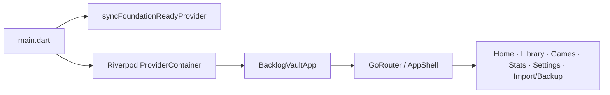
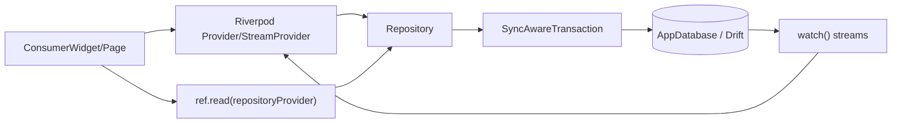
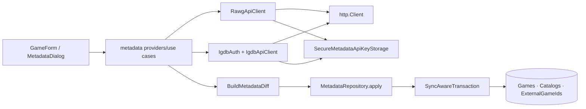
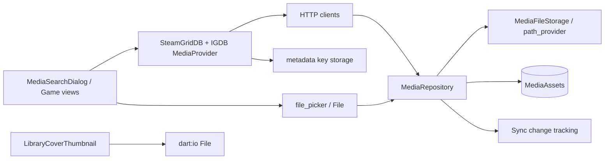
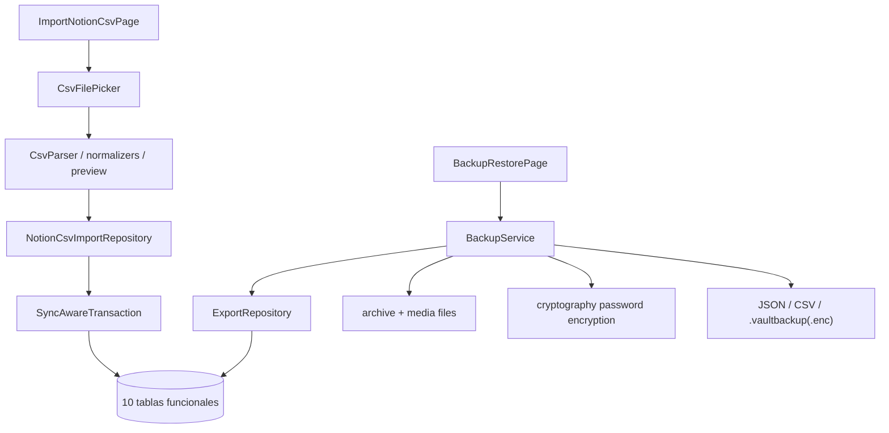
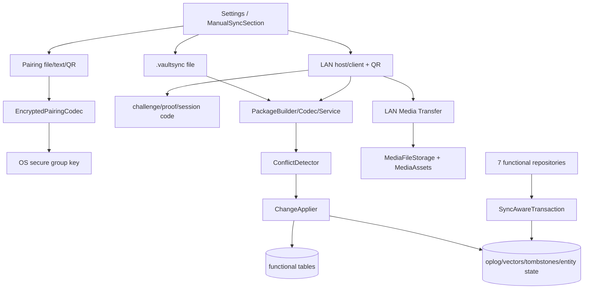

# Arquitectura actual reconstruida

## Entrada, app y routing

`main.dart` crea `ProviderContainer`, dispara `syncFoundationReadyProvider` sin await y monta `UncontrolledProviderScope`. `BacklogVaultApp` observa idioma/router y configura MaterialApp con temas system/light/OLED. `appRouterProvider` define ShellRoute con home, library, statistics, bulk metadata, game create/detail/edit, Notion CSV, settings y backups. Sync no tiene ruta: vive dentro de settings y empuja scanner/dialogs imperativamente.

## Flujo UI → estado → DB

Hay buen uso de streams/providers para lecturas, pero las views disparan repositories y coordinan workflows. No existe una capa ViewModel consistente. `GameListPage`, `GameFormPage`, `GameDetailPage` y bulk import concentran estado, validación, dialogs y commands.

## Persistencia

`AppDatabase` declara 16 tablas y migraciones 1→5. Repositories acceden directamente a tablas/companions. `LibraryGameDetails` y otros application models contienen filas Drift generadas, por lo que schema y UI no están totalmente aislados.

Repositories principales: Game (incluye playthrough), Catalog, LibraryQuery, SavedViews, Metadata, Media, Statistics, Notion CSV y Export/Restore. Los siete mutadores listados en el audit Sync dependen del wrapper Sync.

## Metadata

Metadata es opcional por diseño, pero settings administra credenciales directamente. El app no debe disparar auth/network durante cold start Offline.

## Media

`LibraryCoverThumbnail` accede directamente a File en presentation. Media reutiliza componentes internos de metadata, generando acoplamiento bidireccional.

## Importación/exportación/backup

El logical export v4 cubre las diez entidades funcionales y media, no Sync. Esta separación es valiosa para migrar.

## Sync actual

No hay cloud, discovery automático ni background sync implementado; sí hay protocolos propios manuales y LAN activos.

## Dependencias incorrectas/circulares

- core→features: no detectado.
- presentation→data: frecuente; pages importan repos/providers concretos.
- presentation→filesystem: thumbnail y media/QR surfaces.
- games↔library, games↔metadata/media, media↔metadata, media↔sync y l10n↔features.
- Sync provider global compone demasiadas responsabilidades.
- Repositories mutadores tienen dos responsabilidades: dominio/persistencia + tracking Sync.
- `domain_localizations.dart` invierte dependencia desde l10n hacia features.
- No hay barrels globales problemáticos; el problema es import directo y ownership.

## Testabilidad

Hay 332 tests fuertes en data/domain/widget y DB in-memory, pero no directorio `integration_test/`. Páginas con workflows extensos requieren pumps/mocks complejos. Drift migrations tienen tests actuales, incluido v4→v5 Sync, pero no snapshots generados para una migración destructiva futura.
