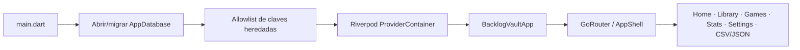
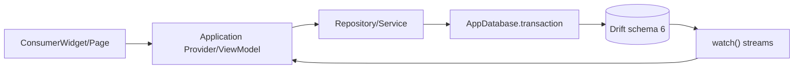
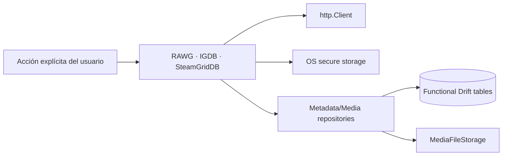

# Arquitectura actual después de E4

Fecha: 2026-07-18. Este documento describe el árbol feature-first activo después
del refactor arquitectónico E4; la reconstrucción previa permanece en
`docs/audit/e1/` y el detalle posterior en `docs/audit/e4/`.

## Entrada, app y routing

`main.dart` crea el `ProviderContainer`, fuerza la apertura/migración de Drift,
ejecuta la limpieza selectiva e idempotente de claves seguras heredadas y monta
`BacklogVaultApp`. Un error de DB no se oculta; un error de secure storage se
reporta sin valores y no elimina credenciales externas.

No existe ruta, provider, listener, job ni inicializador de comunicación entre
dispositivos. Settings contiene exportación JSON, credenciales opcionales e
idioma; no contiene restore, cifrado ni passwords.

## Flujo UI → estado → DB

Catalog, Game, Playthrough, Notion CSV import, Saved Views, Media, Metadata y
Library Export usan repositories transaccionales. La UI recibe read models y
no importa Drift, filesystem, HTTP, plugins ni secure storage.

## Persistencia local

`AppDatabase` declara diez tablas funcionales en schema físico 6: games,
library entries, platforms, library-entry/platform links, genres, game/genre
links, playthroughs, saved views, external game IDs y media assets. La migración
5→6 elimina exclusivamente seis tablas y ocho índices históricos después de
validar el schema funcional y `PRAGMA foreign_key_check`.

El nuevo documento independiente se identifica como
`backlog-vault-library-export`, `formatVersion: 1`. No hereda el schema lógico 4
del backup retirado. Game, LibraryEntry y Playthrough continúan como conceptos
separados.

## Metadata y media

Estas son las únicas capacidades de red y nunca se ejecutan durante bootstrap
ni al usar la biblioteca. Media local, hashing y filesystem permanecen; no hay
packaging o transporte de media entre instalaciones.

## Importación y exportación

- Importación CSV conserva mapping, preview, duplicados y transacción local.
- Export JSON produce un snapshot UTF-8 determinista, sin modificar la DB.
- La serialización, lectura Drift, guardado y comando UI tienen límites
  separados bajo `import_export/library_export`.
- El JSON no incluye paths, bytes de imágenes, credenciales ni secure storage.
- No existe importación/restore JSON, ZIP, cifrado ni merge de paquetes.
- No se producen ni consumen `.vaultsync` o `.vaultpair`.

## Deuda deliberadamente no abordada

Las páginas grandes conservan composición visual y dialogs para no mezclar E4
con el rediseño de E5. El checker impide reintroducir acoplamientos de
infraestructura. La optimización de binarios y dependencias corresponde a E6.
