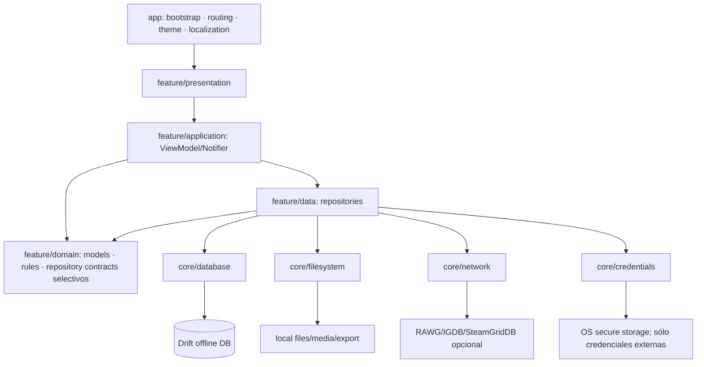
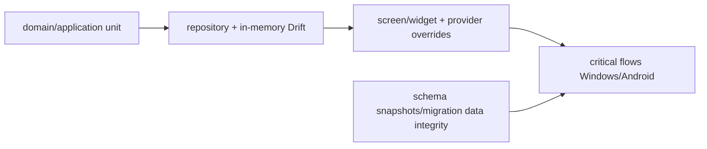

# Arquitectura objetivo Offline

## Forma general

La ruta principal nunca requiere `Net` ni `Secrets`: biblioteca, edición, filtros, vistas, stats, CSV/export y media existente funcionan offline.

## Ownership

### `app`

Composition root, inicialización estrictamente necesaria, routing, shell, theme y wiring de localización. Puede importar features para registrar rutas/providers. No contiene reglas de negocio ni inicializa capacidades opcionales al arranque.

### `core`

Infraestructura estable compartida por dos o más features: Drift/opening/migrations, filesystem primitives, HTTP client policy, secure key-value adapter, errors/logging, IDs/time, design system. Nunca importa `features/`. “Utilities” sólo para funciones cohesivas y realmente compartidas; no depósito genérico.

### `features`

Unidad de producto y ownership. Cada feature crea sólo las capas que necesita:

- `domain/`: conceptos/reglas estables, sin Flutter/Drift/plugin;
- `data/`: repositories e implementations/adapters específicos;
- `application/`: ViewModels, Notifiers, screen state, use cases/coordinators;
- `presentation/`: screens, dialogs y widgets.

Una feature simple puede omitir `domain` o `application`; no se crean carpetas vacías por simetría.

## Cuándo crear cada componente

| Componente | Crear cuando | No crear cuando |
|---|---|---|
| ViewModel/Notifier | screen/workflow mutable, async, múltiples commands o transformación | widget puramente visual o read-only trivial |
| Repository | source of truth/aggregate, consultas/mutaciones y mapeo data→domain | wrapper sin comportamiento sobre una función local |
| Service/DataSource | DB, filesystem, HTTP, secure storage o plugin externo | lógica de negocio/UI |
| Use case | multi-repo, regla reutilizada, operación compleja/transaccional | CRUD directo o delegación de una línea |
| Interface | varias implementaciones, boundary reemplazable, fake claro | “una interfaz por clase” sin sustitución |
| Domain model | concepto estable que cruza data/application/presentation | companion/join interno o DTO efímero |

## Riverpod

- Providers top-level y junto al owner.
- `Provider` para adapters/repositories puros; `StreamProvider` para consultas reactivas simples.
- `NotifierProvider`/`AsyncNotifierProvider` para state mutable/workflow.
- `ref.watch` para dependencias reactivas; `read` para commands puntuales.
- `autoDispose` en state de pantalla cuando no deba sobrevivir navegación.
- Overrides en tests; cleanup con `ref.onDispose` para DB/HTTP controllers.
- Ningún ProviderContainer global accesible fuera del composition root.

## Drift

- `AppDatabase` y generated rows viven en `core/database`/data.
- Repositories entregan domain/read models; no companions/rows a presentation.
- Transacciones Drift locales para operaciones atómicas.
- DAOs sólo si agrupan consultas cohesivas/reutilizadas; no un DAO por tabla obligatorio.
- Schema snapshots, step-by-step migrations y data-integrity tests.
- Soft delete preservado hasta una decisión funcional independiente.

## Filesystem, HTTP y credentials

- Filesystem mediante interfaces/adapters pequeños (`MediaFileStore`, `ExportFileWriter`, picker boundary).
- Paths internos se validan/normalizan; nunca se confían paths externos de backups.
- HTTP clients inyectados, timeout y errores tipados; no llamadas al bootstrap.
- Providers externos anuncian disponibilidad sin credenciales/red.
- Secure storage sólo para API keys/client secret/token; passwords de backup no se guardan.

## Errores y estado async

- Infra traduce errores de plugin/IO/HTTP/DB a failures específicos conservando cause/stack para logs redacted.
- Domain no depende de mensajes localizados.
- ViewModel expone `AsyncValue<ScreenState>` o state sellado equivalente.
- UI traduce failures a l10n y ofrece retry/cancel cuando corresponda.
- No `catch Object` silencioso salvo frontera bootstrap explícita y documentada; Offline no necesita esa excepción Sync actual.

## Features transversales

- Bulk metadata importa contracts domain de library/metadata/media; un coordinator application evita repositories cruzados.
- Statistics consume read models/queries dedicadas, no UI models.
- Metadata y media comparten credentials/HTTP desde core, no importándose mutuamente data internals.
- Localization etiqueta enums mediante extensiones en la presentation de la feature; l10n no importa features.

## Tests

Mirror de `lib/`; fakes pequeños y provider overrides. Flujos críticos: cold start offline, CRUD/soft delete, filters/views, CSV, export/backup/restore, metadata sin/con key/red, media, migración y packaging.

## Peso

Esta arquitectura no promete un APK/EXE menor. La reducción se mide después de retirar scanner/QR/Sync, optimizar ABI/assets y excluir outputs. Cualquier PR arquitectónico debe justificar mantenibilidad/testing, no “peso” sin medición.
