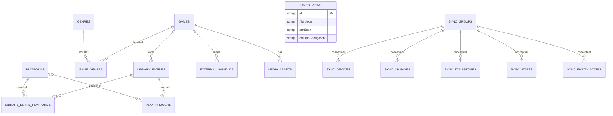

# Auditoría Drift y propuesta de migración

## Versiones

- Schema físico: `databaseSchemaVersion = 5`.
- Schema lógico export/backup: `logicalLibrarySchemaVersion = 4`.
- Protocolo Sync: `syncProtocolVersion = 1`.
- La DB se abre como `backlog_vault` mediante `driftDatabase`.
- No hay triggers. Hay 8 índices custom, todos Sync.

## Schema físico actual

PK es textual salvo indicación; todas las fechas Drift usan su representación SQLite configurada por Drift.

| Tabla | Columnas relevantes | Relaciones/keys | Clasificación |
|---|---|---|---|
| `games` | id, title, sortTitle?, releaseDate?, type, created/updated/deletedAt | PK id | funcional; soft delete |
| `library_entries` | id, gameId, status, personalRating?, personalNotes?, timestamps | FK gameId→games | funcional/usuario; soft delete |
| `platforms` | id, name, shortName?, timestamps | PK id | catálogo; soft delete |
| `library_entry_platforms` | id, entryId, platformId, isPrimary, timestamps | FKs entry/platform | join funcional; soft delete |
| `genres` | id, name, timestamps | PK id | catálogo; soft delete |
| `game_genres` | id, gameId, genreId, timestamps | FKs game/genre | join funcional; soft delete |
| `playthroughs` | id, entryId, platformId?, status, started/completedAt?, hours?, rating?, notes?, timestamps | FK entry; FK platform nullable | funcional/usuario; soft delete |
| `saved_views` | id, name, filterJson, sortJson, columnConfigJson, timestamps | PK id | funcional; soft delete |
| `external_game_ids` | id, gameId, provider, externalId/slug/url/title?, timestamps | FK game | metadata; soft delete |
| `media_assets` | id, gameId, kind/source/provider?, external/remote/local/file/mime/dimensions/hash/selected/attribution, timestamps | FK game | media; soft delete y archivos externos |
| `sync_groups` | id, displayName, protocolVersion, keyId?, status, timestamps | PK id; sin FK | exclusivo Sync; puede referir key segura |
| `sync_devices` | id, syncGroupId?, displayName, platform, isLocal, publicKey?, fingerprint?, status, timestamps | PK id; group no declarado FK | exclusivo Sync/device |
| `sync_changes` | changeId, group/origin/counter/mutation/sequence/entity/op/JSONs/source/hash/timestamps | PK; unique originDeviceId+originCounter | oplog Sync; puede contener snapshots de usuario |
| `sync_tombstones` | id, group/entity/deleteChange/origin/counter/context/hash/dates | PK | borrados Sync; puede reflejar IDs de usuario |
| `sync_states` | id, group/local/peer, counters/vectors/package/epoch/flags/timestamps | PK | vectores Sync |
| `sync_entity_states` | id, group/entity, fieldVersions/vector/change/hash/deleted/timestamp | PK | estado/conflictos Sync |

## Índices explícitos

1. `idx_sync_devices_group_status`
2. `idx_sync_devices_single_local` (unique parcial `is_local = 1`)
3. `idx_sync_changes_entity`
4. `idx_sync_changes_mutation`
5. `idx_sync_changes_origin`
6. `idx_sync_tombstones_entity`
7. `idx_sync_state_peer`
8. `idx_sync_entity_state_entity`

## Evolución

- v1: games, library entries, catalogs/joins y playthroughs.
- v2: `saved_views`.
- v3: `external_game_ids`.
- v4: `media_assets`.
- v5: seis tablas Sync + índices.

El código `onUpgrade` actual sólo prueba `from < N`; para futuras pruebas de destinos intermedios conviene adoptar migraciones step-by-step/snapshots Drift. La documentación oficial advierte que las migraciones manuales son propensas a pérdida y recomienda generar/testear snapshots.

## Diagrama de entidades

Las relaciones Sync son conceptuales: las columnas no declaran `.references()` en Drift. Esto reduce blockers de drop, pero no elimina la necesidad de preservar/validar datos funcionales.

## Datos a preservar

Las diez tablas funcionales completas, incluidos soft-deleted rows, JSON de vistas, IDs externos y registros/media local. El backup lógico v4 ya exporta exactamente esas diez familias y excluye Sync. `BackupService` además empaqueta archivos de media y ofrece cifrado. Esto es una buena frontera de preservación, aunque `ExportRepository.restoreLogical` hoy usa `SyncAwareTransaction` y debe desacoplarse.

`sync_changes.payloadJson/snapshotJson` puede duplicar datos personales. Puede descartarse sólo tras backup funcional validado; no se migra al schema Offline.

## Propuesta segura (no implementada)

Número candidato: **6**, porque SQLite/Drift requieren avanzar monotónicamente desde 5 cuando cambia el schema. No se congela como decisión final hasta aprobar el alcance E2 y generar el snapshot v5.

### Precondiciones

1. App en schema 5 y Sync sin operaciones activas.
2. `.vaultbackup.enc` verificado y, en desarrollo/QA, copia byte-a-byte de DB y media.
3. Todos los repositorios funcionales ya usan transacción local, sin imports Sync.
4. Snapshot v5 exportado con Drift y test `migrateAndValidate` listo.
5. Seed con filas activas/soft-deleted en las 10 tablas y datos en las 6 Sync.

### Migración transaccional

1. Capturar counts y hashes lógicos de las 10 tablas; validar `PRAGMA foreign_key_check`.
2. Borrar los 8 índices Sync con `IF EXISTS`.
3. Drop en orden: `sync_entity_states`, `sync_states`, `sync_tombstones`, `sync_changes`, `sync_devices`, `sync_groups`.
4. No alterar columnas/tablas funcionales en la misma migración.
5. Revalidar FK, counts, soft-deleted rows, JSON parseable y referencias de media.
6. Confirmar que sqlite schema no contiene objetos `sync_*` y sí las 10 tablas funcionales.

Drift recomienda transacción y `foreign_key_check`; si es necesario desactivar FKs para DDL, debe hacerse fuera de la transacción y reactivarse siempre. En este schema no hay FK declaradas desde Sync hacia tablas funcionales.

### Secure storage

Después de migrar, abrir la app y validar DB. Recién entonces ejecutar una limpieza one-shot de device identity y keys con prefijo Sync. No llamar `deleteAll`: borraría RAWG/IGDB/SteamGridDB. Registrar sólo éxito/fallo sin valores.

### Rollback

- Desarrollo/QA: cerrar app, restaurar DB+media copiados y ejecutar build v0.3.
- Usuario: restaurar backup cifrado en versión compatible; no intentar downgrade automático del schema.
- Una migración que ya hizo drop no se “deshace” recreando tablas vacías; el rollback real es restaurar el snapshot previo.

## Pruebas obligatorias E2

- v5→v6 con todos los tipos de datos y Sync poblado.
- apertura repetida post-migración (idempotencia de startup).
- counts/hashes/FKs y ausencia de objetos Sync.
- soft deletes, vistas guardadas, playthroughs, external IDs y media.
- restore lógico/backup cifrado después de migrar.
- fallo simulado antes/durante migración y DB previa intacta.
- secure storage: limpia Sync, preserva credenciales externas.
- Windows y Android con bases reales descartables.

Fuentes: [Drift migrations](https://drift.simonbinder.eu/migrations/), [testing migrations](https://drift.simonbinder.eu/migrations/tests/), [Migrator API](https://drift.simonbinder.eu/migrations/api/), [transactions](https://drift.simonbinder.eu/dart_api/transactions/).
