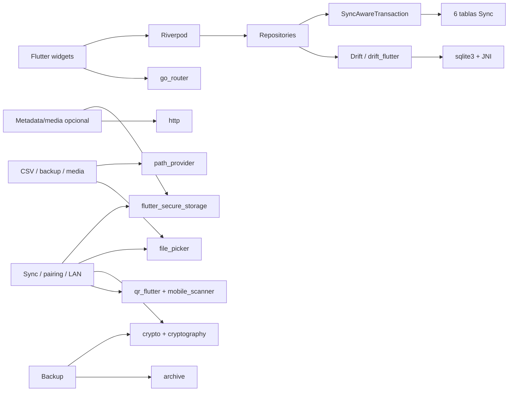
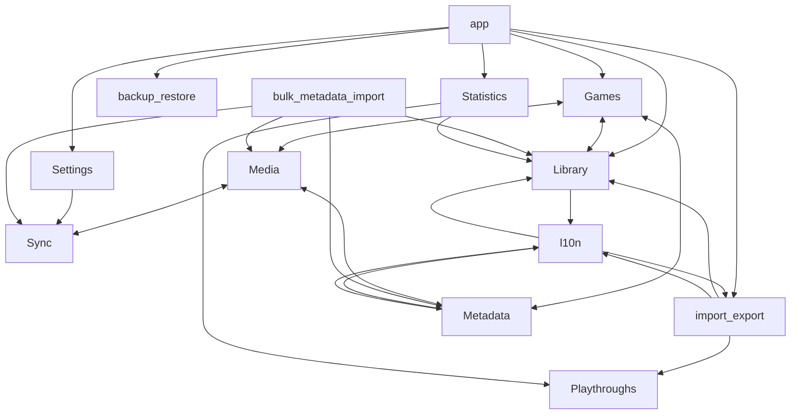
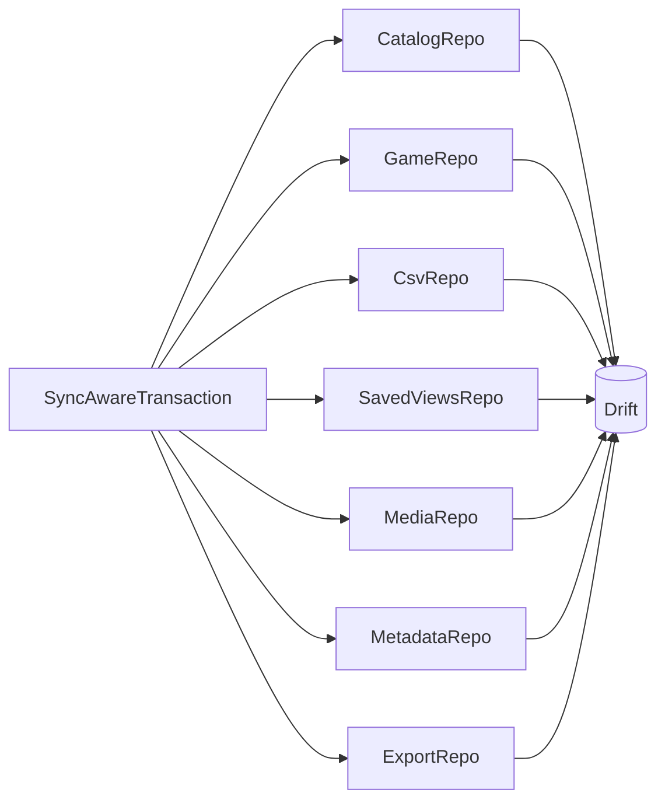
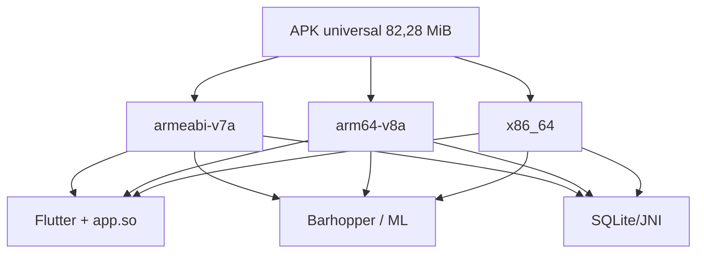

# Mapa de dependencias actual

## Runtime principal

## Features y acoplamientos

Las aristas se calcularon resolviendo imports locales. `core` no importa features, lo cual es correcto. Los problemas están entre features y entre presentation/data.

Los ciclos arquitectónicos relevantes son:

- games ↔ library: aggregates/domains en library, mutaciones en games y páginas library llamando `GameRepository`;
- games ↔ metadata/media: dialogs y modelos cruzan límites de feature;
- media ↔ metadata: media reutiliza auth/client/key storage de metadata, y metadata presenta media;
- media ↔ Sync: Sync transfiere media y `MediaRepository` registra cambios Sync;
- l10n ↔ varias features: `domain_localizations.dart` importa enums de features y las vistas importan l10n.

No se demostró un ciclo de import file-to-file que impida compilar; son ciclos de ownership/feature que vuelven frágiles los cambios.

## Repositorios acoplados a Sync

Esta es la razón por la que E2 no puede empezar borrando `lib/features/sync/`: primero hay que reemplazar la frontera transaccional en esos siete repositorios.

## Nativo

La reducción de APK depende principalmente de retirar scanner/QR y de la estrategia ABI, no de mover archivos Dart.
