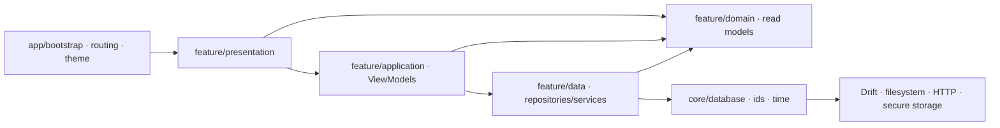
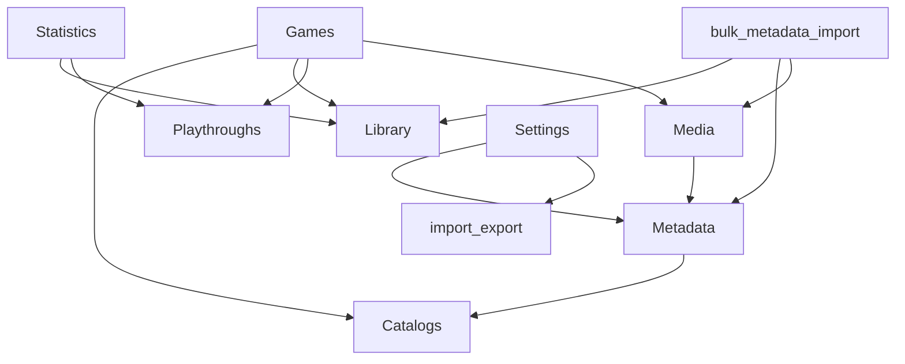

# Dependency map after E4

## Enforced flow

The automated checker proves:

1. `core` has no dependency on features;
2. presentation has no dependency on data, Drift, database, filesystem, HTTP,
   secure storage or FilePicker;
3. data has no dependency on presentation;
4. non-visual feature dependencies form an acyclic graph;
5. removed Sync and legacy backup module paths cannot be reintroduced.

## Cross-feature ownership edges

Presentation composition may open a dialog owned by another feature, but this
edge is visual only and is excluded from the non-visual dependency graph.
Repositories do not call repositories from other features.

## Infrastructure boundaries

- Drift is referenced by concrete repositories only.
- HTTP clients and provider authentication stay in metadata/media data.
- secure storage stays behind `MetadataApiKeyStorage`; Settings observes only
  `ExternalCredentialsState` booleans.
- FilePicker stays behind CSV/export/media services.
- filesystem cover reads return bytes through an application provider.
