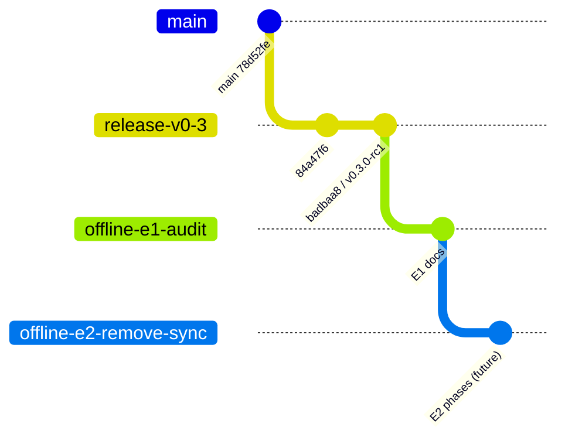

# Plan de consolidación de ramas

## Hecho probado

`release/v0.3` contiene todas las ramas locales y remotas. No hay commits exclusivos que integrar. El baseline canónico es `badbaa8`; E1 agrega sólo docs sobre ese baseline.

## Topología objetivo temporal

## Acciones

1. E1: push `codex/offline-e1-audit`; no merge a main.
2. Aprobación: baseline/ADR/scope.
3. E2: branch desde E1; no merge/cherry-pick de ramas históricas.
4. Mantener `release/v0.3` y tag RC1 inmutables.
5. Mantener `main` sin force/rewrites; integración futura por PR revisado.
6. Tras Offline Release estable, clasificar ramas antiguas para archivar/eliminar con aprobación separada.

## Ramas históricas

- sync foundation, encrypted package, pairing, LAN now/hardening/media: mantener como referencias hasta release Offline.
- sync UX y QR branches: igual; ya contenidas.
- release/v1 y release/v0.2: mantener por tags/releases.
- no recrear ramas locales remotas sólo para “ordenar”; el bundle preserva refs y GitHub las mantiene.

## Prohibiciones

No delete, force push, rebase de releases, filter-repo, tag move ni merge a main en E1. Una futura poda de ramas no reduce significativamente el historial y debe priorizar trazabilidad.

## Gate de consolidación final

Sólo cuando E2–E5 terminen: PR Offline a main, CI/builds/QA, backup/migration validados, versión aprobada. Después se decide retención de ramas y GC local.
